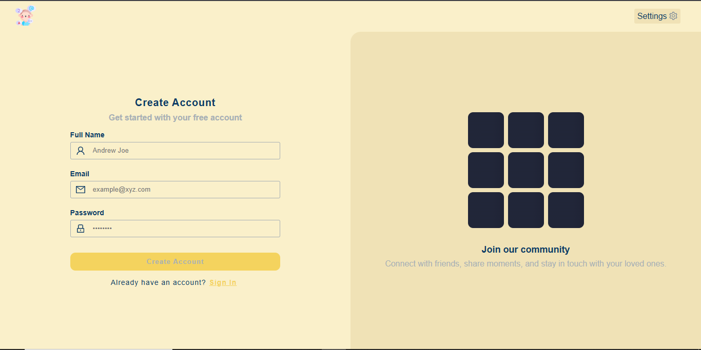
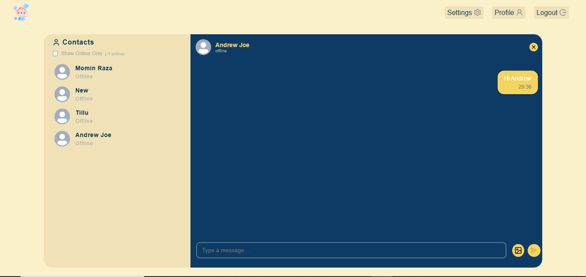
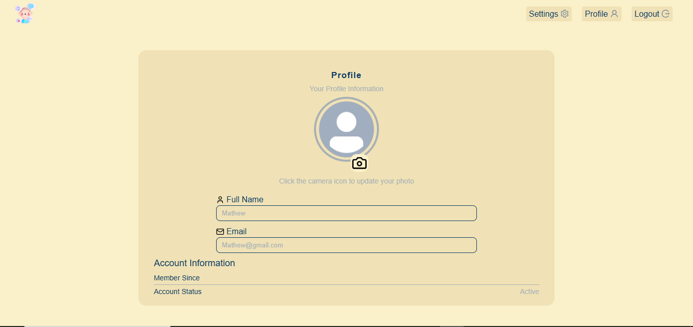
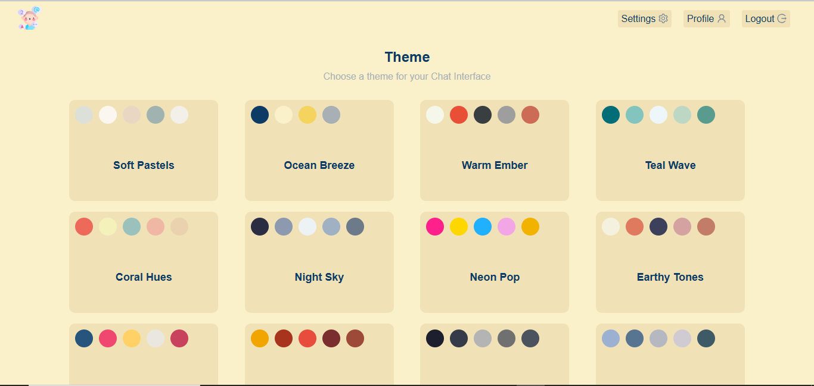

# 💬 Chatty

**Chatty** is a real-time chat application built using the MERN Stack (MongoDB, Express, React, Node.js) with support for user authentication, live messaging using WebSockets (Socket.io), profile picture uploads, and a modern UI powered by Ant Design.

---

## 🚀 Tech Stack

### Frontend:
- [React 18](https://reactjs.org/)
- [React Router DOM v7](https://reactrouter.com/)
- [Ant Design](https://ant.design/)
- [Styled Components](https://styled-components.com/)
- [Zustand](https://github.com/pmndrs/zustand) (State management)
- [Axios](https://axios-http.com/)
- [Moment.js](https://momentjs.com/)
- [Socket.io Client](https://socket.io/)
- [React Hot Toast](https://react-hot-toast.com/)
- [Lucide React](https://lucide.dev/)

### Backend:
- [Node.js](https://nodejs.org/) + [Express.js](https://expressjs.com/)
- [MongoDB](https://www.mongodb.com/) + [Mongoose](https://mongoosejs.com/)
- [Socket.io](https://socket.io/)
- [bcryptjs](https://github.com/dcodeIO/bcrypt.js) (Password hashing)
- [jsonwebtoken](https://github.com/auth0/node-jsonwebtoken) (JWT auth)
- [multer](https://github.com/expressjs/multer) + [Cloudinary](https://cloudinary.com/) (Image upload)
- [dotenv](https://github.com/motdotla/dotenv)
- [cookie-parser](https://github.com/expressjs/cookie-parser)
- [CORS](https://github.com/expressjs/cors)

---

## ✨ Features

- 🔐 User authentication (Signup, Login, Logout)
- 💬 Real-time 1-to-1 messaging with Socket.io
- 📁 Upload and update profile pictures
- 🧑‍🤝‍🧑 Sidebar user list for active conversations
- ✅ Auth-protected routes using middleware
- ⚡ Toast notifications for live feedback
- 🎨 Clean and responsive UI with Ant Design

---

## 🛠️ Local Setup Instructions

### 1. Clone the Repository

```bash
git clone https://github.com/yourusername/chatty.git
cd chatty
````

---

### 2. Setup Environment Variables

Create a `.env` file in the **root** directory and add the following variables:

```env
MONGO_URI=your_mongo_connection_string
JWT_SECRET=your_jwt_secret
CLOUDINARY_CLOUD_NAME=your_cloud_name
CLOUDINARY_API_KEY=your_api_key
CLOUDINARY_API_SECRET=your_api_secret
```

---

### 3. Install Frontend Dependencies

```bash
cd frontend
npm install
npm run dev
```

---

### 4. Install Backend Dependencies

```bash
cd ../backend
npm install
npm run dev
```

Make sure both frontend and backend servers are running. By default:

* Frontend runs on `http://localhost:5173`
* Backend runs on `http://localhost:5000` (or as configured)

---

## 📂 Folder Structure (Simplified)

```
chatty/
├── frontend/       # React Vite project
├── backend/        # Node.js + Express server
└── .env            # Environment configuration
```

---

## 📸 Screenshot











